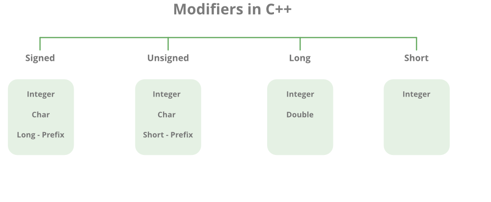

# Type System in C++

Before we dive into type system let's take a brief look at what we have as types in the language.

## Rule to follow

In C++ we write a variable as follows:

```cpp
DATA_TYPE VARIABLE_NAME = VALUE;
```

We can only declare a variable in one line and give it a value in other place in the code like so.

```cpp
DATA_TYPE VARIABLE_NAME;
...
...
VARIABLE_NAME = VALUE;
```

Let's take an example; we can declare a variable of type `int` to showcase the usage:

```cpp
#include <iostream>

int main()
{
  int number = 3;

  std::cout << number << std::endl;

  return 0;
}
```

Let's run the code:

```bash
$ g++ main.cpp -o main && ./main
3
```

BTW you can get rid of `std::` in front of commands by `using namespace std;` but I don't recommend it ❌

```cpp
#include <iostream>

using namespace std;

int main()
{
  cout << "Hi" << endl;
}
```

Also the `return` statement is optional in `main`.

---

<br/>

Think a little about this code ⁉️:

```cpp
#include <iostream>

int main()
{
  int number;

  std::cout << number << std::endl; // ??

  number = 5;

  std::cout << number << std::endl;

  return 0;
}
```

<br/>

---

## Types in C++

In short (as mentioned before) what types do to variables don't really matters, what matters is the size of the type that is allocated in memory.

The following is a list of most data types in the language with its size:

- `char`  - - - - - 1 byte
- `bool`  - - - - - 1 byte
- `short` - - - - 2 bytes
- `int` - - - - - - 4 bytes
- `float` - - - - 4 bytes
- `wchar_t` - - 4 bytes
- `double` - - - 8 bytes
- `long` - - - - - 8 bytes

<!-- <table style="text-align:center;">
  <tbody>
    <tr>
      <th rowspan="2"> Type specifier
      </th>
      <th rowspan="2"> Equivalent type
      </th>
      <th colspan="2"> Width in bits by data model
      </th>
    </tr>
    <tr>
      <th> C++ Standart
      </th>
      <th> x64 - 64 bit
      </th>
    </tr>
    <tr>
      <td>
        <div style="text-align:left; width:auto; margin-left:auto; margin-right:auto;">
          <span class="t-c">
            <span class="mw-geshi cpp source-cpp"><span class="kw4">short</span></span></span>
        </div>
      </td>
      <td rowspan="4">
        <span class="t-c">
          <span class="mw-geshi cpp source-cpp">
            <span class="kw4">short</span>
            <span class="kw4">int</span>
          </span>
        </span>
      </td>
      <td rowspan="6"> at least<br> <b>16</b>
      </td>
      <td rowspan="6"> <b>16</b>
      </td>
      </td>
    </tr>
    <tr>
      <td>
        <div style="text-align:left; width:auto; margin-left:auto; margin-right:auto;">
          <span class="t-c">
            <span class="mw-geshi cpp source-cpp">
              <span class="kw4">short</span>
              <span class="kw4">int</span>
            </span>
          </span>
        </div>
      </td>
    </tr>
    <tr>
      <td>
        <div style="text-align:left; width:auto; margin-left:auto; margin-right:auto;">
          <span class="t-c">
            <span class="mw-geshi cpp source-cpp">
              <span class="kw4">signed</span>
              <span class="kw4">short</span>
            </span>
          </span>
        </div>
      </td>
    </tr>
    <tr>
      <td>
        <div style="text-align:left; width:auto; margin-left:auto; margin-right:auto;">
          <span class="t-c">
            <span class="mw-geshi cpp source-cpp">
              <span class="kw4">signed</span>
              <span class="kw4">short</span>
              <span class="kw4">int</span>
            </span>
          </span>
        </div>
      </td>
    </tr>
    <tr>
      <td>
        <div style="text-align:left; width:auto; margin-left:auto; margin-right:auto;">
          <span class="t-c">
            <span class="mw-geshi cpp source-cpp">
              <span class="kw4">unsigned</span>
              <span class="kw4">short</span>
            </span>
          </span>
        </div>
      </td>
      <td rowspan="2">
        <span class="t-c">
          <span class="mw-geshi cpp source-cpp">
            <span class="kw4">unsigned</span>
            <span class="kw4">short</span>
            <span class="kw4">int</span>
          </span>
        </span>
      </td>
    </tr>
    <tr>
      <td>
        <div style="text-align:left; width:auto; margin-left:auto; margin-right:auto;">
          <span class="t-c">
            <span class="mw-geshi cpp source-cpp">
              <span class="kw4">unsigned</span>
              <span class="kw4">short</span>
              <span class="kw4">int</span>
            </span>
          </span>
        </div>
      </td>
    </tr>
    <tr>
      <td>
        <div style="text-align:left; width:auto; margin-left:auto; margin-right:auto;">
          <span class="t-c">
            <span class="mw-geshi cpp source-cpp">
              <span class="kw4">int</span>
            </span>
          </span>
        </div>
      </td>
      <td rowspan="3">
        <span class="t-c">
          <span class="mw-geshi cpp source-cpp">
            <span class="kw4">int</span>
          </span>
        </span>
      </td>
      <td rowspan="5">
        at least<br>
        <b>16</b>
      </td>
      <td rowspan="5"> <b>32</b>
      </td>
    </tr>
    <tr>
      <td>
        <div style="text-align:left; width:auto; margin-left:auto; margin-right:auto;">
          <span class="t-c">
            <span class="mw-geshi cpp source-cpp">
              <span class="kw4">signed</span>
            </span>
          </span>
        </div>
      </td>
    </tr>
    <tr>
      <td>
        <div style="text-align:left; width:auto; margin-left:auto; margin-right:auto;">
          <span class="t-c">
            <span class="mw-geshi cpp source-cpp">
              <span class="kw4">signed</span>
              <span class="kw4">int</span>
            </span>
          </span>
        </div>
      </td>
    </tr>
    <tr>
      <td>
        <div style="text-align:left; width:auto; margin-left:auto; margin-right:auto;">
          <span class="t-c">
            <span class="mw-geshi cpp source-cpp">
              <span class="kw4">unsigned</span>
            </span>
          </span>
        </div>
      </td>
      <td rowspan="2"> <span class="t-c"><span class="mw-geshi cpp source-cpp"><span class="kw4">unsigned</span> <span
              class="kw4">int</span></span></span>
      </td>
    </tr>
    <tr>
      <td>
        <div style="text-align:left; width:auto; margin-left:auto; margin-right:auto;"><span class="t-c"><span
              class="mw-geshi cpp source-cpp"><span class="kw4">unsigned</span> <span
                class="kw4">int</span></span></span></div>
      </td>
    </tr>
    <tr>
      <td>
        <div style="text-align:left; width:auto; margin-left:auto; margin-right:auto;"><span class="t-c"><span
              class="mw-geshi cpp source-cpp"><span class="kw4">long</span></span></span></div>
      </td>
      <td rowspan="4"> <span class="t-c"><span class="mw-geshi cpp source-cpp"><span class="kw4">long</span> <span
              class="kw4">int</span></span></span>
      </td>
      <td rowspan="6"> at least<br> <b>32</b>
      </td>
      <td rowspan="6"> <b>32/64</b><br>
        depends<br>on the<br>compiler
      </td>
    </tr>
    <tr>
      <td>
        <div style="text-align:left; width:auto; margin-left:auto; margin-right:auto;"><span class="t-c"><span
              class="mw-geshi cpp source-cpp"><span class="kw4">long</span> <span class="kw4">int</span></span></span>
        </div>
      </td>
    </tr>
    <tr>
      <td>
        <div style="text-align:left; width:auto; margin-left:auto; margin-right:auto;"><span class="t-c"><span
              class="mw-geshi cpp source-cpp"><span class="kw4">signed</span> <span
                class="kw4">long</span></span></span></div>
      </td>
    </tr>
    <tr>
      <td>
        <div style="text-align:left; width:auto; margin-left:auto; margin-right:auto;"><span class="t-c"><span
              class="mw-geshi cpp source-cpp"><span class="kw4">signed</span> <span class="kw4">long</span> <span
                class="kw4">int</span></span></span></div>
      </td>
    </tr>
    <tr>
      <td>
        <div style="text-align:left; width:auto; margin-left:auto; margin-right:auto;"><span class="t-c"><span
              class="mw-geshi cpp source-cpp"><span class="kw4">unsigned</span> <span
                class="kw4">long</span></span></span></div>
      </td>
      <td rowspan="2"> <span class="t-c"><span class="mw-geshi cpp source-cpp"><span class="kw4">unsigned</span> <span
              class="kw4">long</span> <span class="kw4">int</span></span></span>
      </td>
    </tr>
    <tr>
      <td>
        <div style="text-align:left; width:auto; margin-left:auto; margin-right:auto;"><span class="t-c"><span
              class="mw-geshi cpp source-cpp"><span class="kw4">unsigned</span> <span class="kw4">long</span> <span
                class="kw4">int</span></span></span></div>
      </td>
    </tr>
    <tr>
      <td>
        <div style="text-align:left; width:auto; margin-left:auto; margin-right:auto;"><span class="t-c"><span
              class="mw-geshi cpp source-cpp"><span class="kw4">long</span> <span class="kw4">long</span></span></span>
        </div>
      </td>
      <td rowspan="4"> <span class="t-c"><span class="mw-geshi cpp source-cpp"><span class="kw4">long</span> <span
              class="kw4">long</span> <span class="kw4">int</span></span></span> <br> <span
          class="t-mark-rev t-since-cxx11">(C++11)</span>
      </td>
      <td rowspan="6"> at least<br> <b>64</b>
      </td>
      <td rowspan="6"> <b>64</b>
      </td>
    </tr>
    <tr>
      <td>
        <div style="text-align:left; width:auto; margin-left:auto; margin-right:auto;"><span class="t-c"><span
              class="mw-geshi cpp source-cpp"><span class="kw4">long</span> <span class="kw4">long</span> <span
                class="kw4">int</span></span></span></div>
      </td>
    </tr>
    <tr>
      <td>
        <div style="text-align:left; width:auto; margin-left:auto; margin-right:auto;"><span class="t-c"><span
              class="mw-geshi cpp source-cpp"><span class="kw4">signed</span> <span class="kw4">long</span> <span
                class="kw4">long</span></span></span></div>
      </td>
    </tr>
    <tr>
      <td>
        <div style="text-align:left; width:auto; margin-left:auto; margin-right:auto;"><span class="t-c"><span
              class="mw-geshi cpp source-cpp"><span class="kw4">signed</span> <span class="kw4">long</span> <span
                class="kw4">long</span> <span class="kw4">int</span></span></span></div>
      </td>
    </tr>
    <tr>
      <td>
        <div style="text-align:left; width:auto; margin-left:auto; margin-right:auto;"><span class="t-c"><span
              class="mw-geshi cpp source-cpp"><span class="kw4">unsigned</span> <span class="kw4">long</span> <span
                class="kw4">long</span></span></span></div>
      </td>
      <td rowspan="2"> <span class="t-c"><span class="mw-geshi cpp source-cpp"><span class="kw4">unsigned</span> <span
              class="kw4">long</span> <span class="kw4">long</span> <span class="kw4">int</span></span></span> <br>
        <span class="t-mark-rev t-since-cxx11">(C++11)</span>
      </td>
    </tr>
    <tr>
      <td>
        <div style="text-align:left; width:auto; margin-left:auto; margin-right:auto;"><span class="t-c"><span
              class="mw-geshi cpp source-cpp"><span class="kw4">unsigned</span> <span class="kw4">long</span> <span
                class="kw4">long</span> <span class="kw4">int</span></span></span></div>
      </td>
    </tr>
  </tbody>
</table> -->

A very common way is to use the `sizeof` operator to know the size in bytes.

```cpp
#include <iostream>

int main()
{
  std::cout << sizeof int << std::endl;
}
```

Also we can use it as follows:

```cpp
#include <iostream>

int main()
{
  std::cout << sizeof(int) << std::endl;
}

```

We can also save some headaches by `#include <cinttypes>`.

It gives us a variety of types to use indicated by size of bits like `uint8_t`.

### Datatypes Modifiers



__!__ Note: be smart while using these modifiers! there's no such thing as `long float` __!__

<br/>

Try out this code:

```cpp
// C++ program to sizes of data types
#include <iostream>

using namespace std;

int main()
{
  cout << "Size of char : " << sizeof(char) << " byte" << endl;
  cout << "Size of int : " << sizeof(int) << " bytes" << endl;
  cout << "Size of short int : " << sizeof(short int) << " bytes" << endl;
  cout << "Size of long int : " << sizeof(long int) << " bytes" << endl;
  cout << "Size of signed long int : " << sizeof(signed long int) << " bytes" << endl;
  cout << "Size of unsigned long int : " << sizeof(unsigned long int) << " bytes" << endl;
  cout << "Size of float : " << sizeof(float) << " bytes" << endl;
  cout << "Size of double : " << sizeof(double) << " bytes" << endl;
  cout << "Size of wchar_t : " << sizeof(wchar_t) << " bytes" << endl;
  return 0;
}
```
Possible output on __`x86_64`__ system:

```text
Size of char : 1 byte
Size of int : 4 bytes
Size of short int : 2 bytes
Size of long int : 8 bytes
Size of signed long int : 8 bytes
Size of unsigned long int : 8 bytes
Size of float : 4 bytes
Size of double : 8 bytes
Size of wchar_t : 4 bytes
```

## More Examples

Let's use `char`:

```cpp
#include <iostream>

int main()
{
  char letter = 'M';

  std::cout << letter << std::endl; // M
}

// note that the character case we use single quotes!
```

### Think About This Code

```cpp
#include <iostream>

int main()
{
  int letter1 = 'A';
  char letter2 = 65;

  std::cout << letter1 << ", " << letter2 << std::endl; // ??
}
```


ASCII Reference: <https://en.wikipedia.org/wiki/ASCII>

ASCII Table: <https://www.asciitable.com/>

Unicode Reference: <https://en.wikipedia.org/wiki/Unicode>

Funny Webite: <https://home.unicode.org/>

__!__ ASCII stands for: _American Standard Code for Information Interchange_ __!__

### Let's Think About The Following Code

```cpp
#include <iostream>

int main()
{
  double a = 5.5;
  float b = 5.5;

  std::cout << sizeof(a) << ", " << sizeof(5.5) << std::endl; // 8, 8
  std::cout << sizeof(b) << ", " << sizeof(5.5) << std::endl; // 4, 8 ??!

  std::cout << sizeof(5.5f) << std::endl; // 4

  // from this code we know that assigning 5.5 without an 'f' unit 
  // will assign a double not a float
}
```

So the fix for this code is:

```cpp
...
  float b = 5.5f;
...
```
